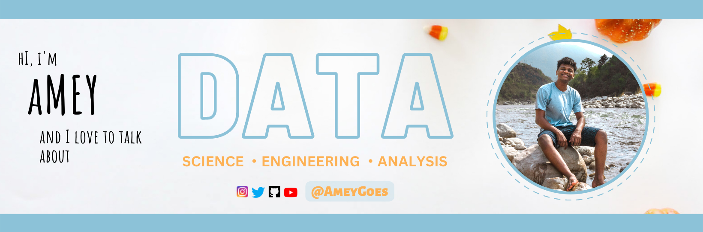

  <!--  HeadLine -->

  <!--  HeadLine Ends -->
  
  
  

  <!-- A bit about what I do? -->
  - 🔭 I’m currently a Computer Science Graduate Student at Arizona State University.

  - 🌱 Visit my [Portfolio](https://ameyportfolio.netlify.app/)
  
  - 👯 I’m looking for Summer Internship Opportunities to expand my knowledge and network.

  - 👨‍💻 All of my projects are available at my [GitHub](https://github.com/ameygoes)

  - 📫 How to reach me **amey.bhilegaonkar@asu.edu**

  - ⚡ Fun fact  

  
  

  <h3 align="left">My Skills</h3>
  

  <!-- Amazon CLoud -->
  
  <!-- GCP -->
  
  <!-- Docker -->
  
  <!-- GIT -->
  
  <!-- JENKINS -->
  
  <!-- Bash -->
  
  <!-- LINUX -->
  
  <!-- Cassandra -->
  
  <!-- MySQL -->
  
  <!-- python -->
  
  <!-- JAVA -->
  
  <!-- Spring -->
  
  <!-- TensorFlow -->
  
  <!-- OpenCV -->
  
  <!-- Scikit Learn -->
  
  <!-- Pytorch -->
  
  

  <!--  Connect With me -->
  <h3 align="left">My Socials:</h3>
  

  <!--  LinkedIn  -->
  
  <!--  Instagram  -->
  
  <!--YouTube    -->
  
  <!--  Medium  -->
  
  <!--  PodCasts  -->
  
  

  

  <h3 align="left">Support:</h3>
  

   
   
   
  

